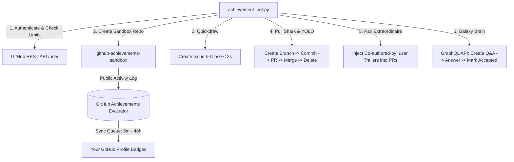

<div align="center">

# 🏆 GitHub Achievements Automation Bot

**Automate and unlock available GitHub profile achievement badges safely, cleanly, and reliably.**

[](https://github.com/RaftFeed/spam-badges/actions/workflows/ci.yml)
[](https://www.python.org/downloads/)
[](LICENSE)
[](CONTRIBUTING.md)
[](https://github.com/RaftFeed/spam-badges/stargazers)

<p align="center">
  <a href="#-badges-showcase">Badges Showcase</a> •
  <a href="#-architecture">Architecture</a> •
  <a href="#-features">Features</a> •
  <a href="#-quick-start">Quick Start</a> •
  <a href="#-cli-reference">CLI Reference</a> •
  <a href="#-troubleshooting--faq">Troubleshooting & FAQ</a> •
  <a href="#-contributing">Contributing</a>
</p>

</div>

---

## 🎯 Badges Showcase

| Badge | Achievement Name | Tier Requirements | Award Speed | Automation Mechanism |
|:---:|:---|:---|:---:|:---|
|  | **Quickdraw** | Closed an issue or PR within 5 minutes of opening | **Instant** (< 5m) | Creates an issue via REST API and closes it in under 2 seconds. |
|  | **YOLO** | Merged a pull request without code review | **Instant** (< 5m) | Automatically creates and merges a feature branch PR into `main` without review. |
|  | **Pull Shark** | Merged pull requests:<br>• **Bronze**: 2 PRs<br>• **Silver**: 16 PRs<br>• **Gold**: 128 PRs | **24–48h sync** | Automated branch creation, commit, PR creation, merge, and branch cleanup loop. |
|  | **Pair Extraordinaire** | Co-authored merged pull requests:<br>• **Bronze**: 1 PR<br>• **Silver**: 10 PRs<br>• **Gold**: 24 PRs | **24–48h sync** | Commits via bot author with your verified account explicitly added to `Co-authored-by:` trailers. |
|  | **Galaxy Brain** | Answered discussions marked as accepted:<br>• **Bronze**: 2 answers<br>• **Silver**: 8 answers<br>• **Gold**: 16 answers | **Fast** (< 1h) | Multi-account GraphQL automation: Helper account asks, your account answers, helper accepts. |

> [!NOTE]
> **Community & Retired Badges**:
> - **Starstruck**: Requires 16 / 128 / 512 / 4096 distinct GitHub users to star your repository.
> - **Public Sponsor**: Requires sponsoring an open-source contributor ($1+) on GitHub Sponsors.
> - **Arctic Code Vault / Mars 2020**: Historical archive snapshots (now permanently retired).

---

## 🏗 Architecture



---

## ✨ Features

- 🛡️ **Zero-Pollution Sandbox**: All activity takes place inside an isolated, disposable public sandbox repo (`github-achievements-sandbox`), keeping your personal and work repositories clean.
- ⚡ **Pure API Execution**: Operates 100% via GitHub REST v3 and GraphQL v4 APIs—no local git pushes or credential caching problems.
- 🤝 **Legitimate Co-Author Attribution**: Specifically crafts Git trailers so GitHub's contributor engine recognizes **your** account as the co-author on merged pull requests.
- 🧠 **Two-Account Helper Mode**: Solves GitHub's anti-gaming filter on **Galaxy Brain** by using a secondary/collaborator account to ask questions and accept your answers.
- 🎨 **Rich Terminal Experience**: Interactive menu, live spinners, progress bars, and colored diagnostic status tables powered by `rich`.
- 🔍 **Live Diagnostics**: Built-in status inspector checks your repository PR progress against your live GitHub profile achievements tab.

---

## 🚀 Quick Start

### 1. Prerequisites
- **Python 3.9+** (`python --version`)
- **Git** (`git --version`)

### 2. Installation
```bash
git clone https://github.com/RaftFeed/spam-badges.git
cd spam-badges
pip install -r requirements.txt
```

### 3. Generate a GitHub Personal Access Token (PAT)
1. Go to **[GitHub Settings → Personal Access Tokens (Classic)](https://github.com/settings/tokens)**.
2. Click **Generate new token (classic)**.
3. Set the Note to: `GitHub Achievements Bot`.
4. Select the following scopes:
   - `repo` *(Full control of repositories, issues, PRs, and commits)*
   - `read:user` *(To automatically fetch your username and verified email)*
   - `write:discussion` *(To manage Discussions for Galaxy Brain)*
5. Click **Generate token** and copy the `ghp_...` key.

### 4. Configure Environment
Copy [.env.example](.env.example) to `.env`:
```bash
# Windows PowerShell:
Copy-Item .env.example .env

# Linux / macOS:
cp .env.example .env
```
Open `.env` and paste your token:
```env
GITHUB_TOKEN=ghp_your_personal_access_token_here
GITHUB_REPO=github-achievements-sandbox
```

---

## 🎮 Usage

### Option A: Interactive CLI Menu (Recommended)
Simply launch the bot without arguments:
```bash
python achievement_bot.py
```
You will be greeted with an interactive menu:
```
Available Actions
┌─────┬─────────────────────────────────────────────────────────────┬────────────────────────────────────────────────────────┐
│ Key │ Action                                                      │ Badge(s) Awarded                                       │
├─────┼─────────────────────────────────────────────────────────────┼────────────────────────────────────────────────────────┤
│  1  │ Run All Badges (Recommended Combo)                          │ Quickdraw + YOLO + Pull Shark + Pair Extraordinaire    │
│  2  │ Quickdraw only                                              │ Quickdraw (Close issue within 5m)                      │
│  3  │ YOLO only                                                   │ YOLO (Merge 1 PR without review)                       │
│  4  │ Pull Shark (Select tier: 2, 16, 128)                        │ Pull Shark (Bronze: 2, Silver: 16, Gold: 128)          │
│  5  │ Pair Extraordinaire (With your account as Co-Author)        │ Pair Extraordinaire (Bronze: 1, Silver: 10, Gold: 24) │
│  6  │ Galaxy Brain (Requires 2 accounts)                          │ Galaxy Brain (Bronze: 2, Silver: 8, Gold: 16)         │
│  7  │ Inspect Live Achievements Status & Diagnostics              │ View live progress and sync diagnosis                  │
│  0  │ Exit                                                        │ Quit application                                       │
└─────┴─────────────────────────────────────────────────────────────┴────────────────────────────────────────────────────────┘
```

---

### Option B: Command Line Automation

#### 🌟 All-in-One Full Combo
Run Quickdraw + YOLO + Pull Shark + Pair Extraordinaire in a single sweep:
```bash
# Default (16 PRs for Silver Pull Shark & Pair Extraordinaire):
python achievement_bot.py --all

# Custom PR count:
python achievement_bot.py --all --prs 24
```

#### 🔍 Live Status & Diagnostic Inspection
Inspect your repository activity and verify how many PRs have been merged:
```bash
python achievement_bot.py --status
```

#### 🎯 Individual Badges
```bash
# Quickdraw (Closes issue in < 2 seconds)
python achievement_bot.py --badge quickdraw

# YOLO (Merges 1 PR without code review)
python achievement_bot.py --badge yolo

# Pull Shark (16 PRs for Silver Tier)
python achievement_bot.py --badge pull-shark --prs 16

# Pair Extraordinaire (10 PRs with your account credited as Co-Author)
python achievement_bot.py --badge pair-extraordinaire --prs 10

# Galaxy Brain (with secondary helper account)
python achievement_bot.py --badge galaxy-brain --helper-token ghp_secondary_account_token
```

---

## 📖 CLI Reference

| Flag | Short | Description | Default |
|---|:---:|---|---|
| `--token` | `-t` | Your GitHub Personal Access Token (Classic) | Read from `.env` |
| `--repo` | `-r` | Target sandbox repository name | `github-achievements-sandbox` |
| `--all` | | Execute the full recommended badge automation combo | `False` |
| `--badge` | | Target specific badge: `quickdraw`, `yolo`, `pull-shark`, `pair-extraordinaire`, `galaxy-brain` | `None` |
| `--status` | | Inspect live repository progress and achievement sync status | `False` |
| `--prs` | | Number of PRs to create and merge | `16` |
| `--helper-token` | | Secondary GitHub account token for Galaxy Brain | Read from `.env` |
| `--coauthor-name` | | Optional collaborator display name | `Monalisa Octocat` |
| `--coauthor-email` | | Optional collaborator email | `octocat@users.noreply.github.com` |

---

## ⏱ Troubleshooting & FAQ

### Why do Quickdraw and YOLO show up instantly, but Pull Shark / Pair Extraordinaire are delayed?
- **Single-Event vs. Counter-Aggregated Badges**:
  - **Quickdraw & YOLO** are single-event triggers. GitHub evaluates and displays them on your profile within **1 to 5 minutes**.
  - **Pull Shark & Pair Extraordinaire** are tiered counters (2, 16, 128 PRs). GitHub processes counter badges via **asynchronous batch background cron jobs**. It typically takes **24 to 48 hours** for GitHub's achievement aggregator to refresh your profile.
- You can verify that your PRs were merged properly at any time by running:
  ```bash
  python achievement_bot.py --status
  ```

### How can I force GitHub to re-render my profile achievements?
Sometimes GitHub caches your achievements tab. You can prompt GitHub to re-index your profile:
1. Go to **[github.com/settings/profile](https://github.com/settings/profile)**.
2. Make a minor change (e.g., add a space to your **Bio** or **Location**).
3. Click **Update profile**.
4. Open an Incognito/Private browser window and check: `https://github.com/<YOUR_USERNAME>?tab=achievements`.

### Why does Galaxy Brain require a second account?
GitHub's anti-abuse filter **strictly ignores self-answers**. If you ask a question and mark your own answer as accepted using the same account, GitHub will not count it toward Galaxy Brain. Using `--helper-token` enables a second account to ask the question and accept your solution legitimately.

---

## 📁 Repository Structure

```
spam-badges/
├── .github/
│   ├── ISSUE_TEMPLATE/
│   │   ├── bug_report.yml          # GitHub Issue Form for bug reporting
│   │   ├── feature_request.yml     # GitHub Issue Form for enhancements
│   │   └── config.yml              # Issue template configuration
│   ├── workflows/
│   │   └── ci.yml                  # GitHub Actions CI workflow
│   └── pull_request_template.md    # Pull Request template
├── achievement_bot.py              # Core automation engine & CLI
├── requirements.txt                # Python package dependencies
├── pyproject.toml                  # Python package build configuration
├── .env.example                    # Environment variable template
├── .gitignore                      # Git ignore rules for secrets & cache
├── LICENSE                         # MIT License
├── CONTRIBUTING.md                 # Contribution guidelines
├── CODE_OF_CONDUCT.md              # Contributor Covenant v2.1
├── SECURITY.md                     # Security policy & vulnerability reporting
└── README.md                       # Documentation & usage manual
```

---

## 🤝 Contributing

Contributions are welcome! Whether you want to report a bug, suggest an enhancement, or optimize API performance, please check out [CONTRIBUTING.md](CONTRIBUTING.md).

Please ensure you follow our [Code of Conduct](CODE_OF_CONDUCT.md).

---

## 🔒 Security

Please review [SECURITY.md](SECURITY.md) for information on how to report vulnerabilities and best practices for managing Personal Access Tokens.

---

## 📜 License

This project is licensed under the **MIT License** - see the [LICENSE](LICENSE) file for details.

---

<div align="center">
  <sub>Built with ❤️ by <a href="https://github.com/RaftFeed">Rafid Harsyah</a>. Star this repo if it helped you unlock your badges! ⭐</sub>
</div>
